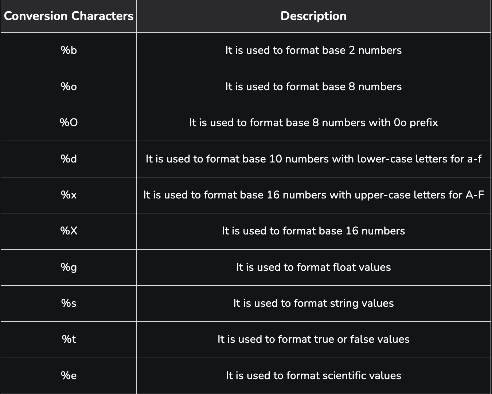

# Print & Logs in Go

## `fmt.Print`

- Go `fmt` package provides us with three different functions to print to the `stdout`.

!!! info "Print in Go"
    - **fmt.Print**
    - **fmt.Println**: print with "\n"
    - **fmt.Printf**: formatted print. print some variables too.

---

## `fmt.Printf` format specifiers



---

## `Logs` in Go

- The `log functions print to stderr` by default and `can be directed to an arbitrary writer`.
- The fmt.Printf function prints to stdout.
- The log functions can `print timestamp`, source code location and other info.
- The log functions and fmt.Printf are both thread safe, but concurrent writes by fmt.Printf above an OS dependent size can be interleaved.

!!! info "logs in Go"
    - **log.Print**
    - **log.Println**: print with "\n"
    - **log.Printf**: formatted print. print some variables too.
    - **log.Fatal**: log and then `os.Exit(1)`
    - **log.Fatalln**: log with "\n".
    - **log.Fatalf**: formatted log

---

## Note 👇🏻

!!! warning "Remember"
    - `fmt` outputs to `stdout`
    - `log` outputs to `stderr` by default but can be configured to any other writer.

---

## Logging to a file

- Use `log.SetOutput(file)` to set logs output to a file.

```go
    package main

    import (
        "log"
        "os"
        "time"
    )

    func main() {
        log.Println("Hello from log.Println") // Log message with timestamp

        // Open a file in append mode, create it if it doesn't exist
        file, err := os.OpenFile("logfile.log", os.O_APPEND|os.O_CREATE|os.O_WRONLY, 0644)
        if err != nil {
            log.Fatal(err) // Logs to stderr by default
        }
        defer file.Close()

        // Redirect log output to the file
        log.SetOutput(file)

        i := 0

        for {
            // This will now write to logfile.log instead of stderr
            log.Printf("This is a log message with count: %d", i)
            i++
            time.Sleep(1 * time.Second)
        }
    }
```
